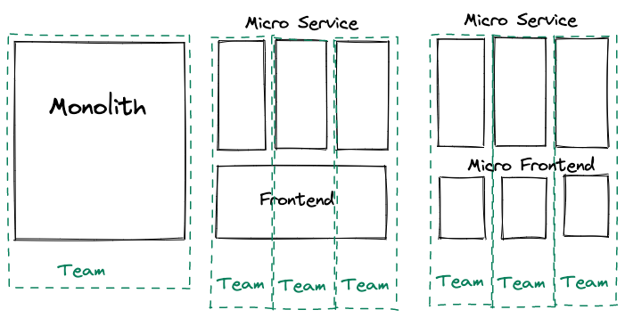
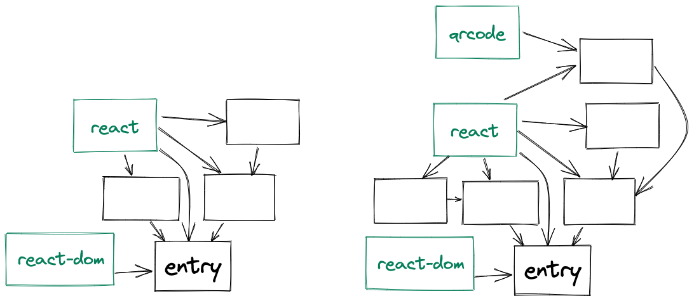
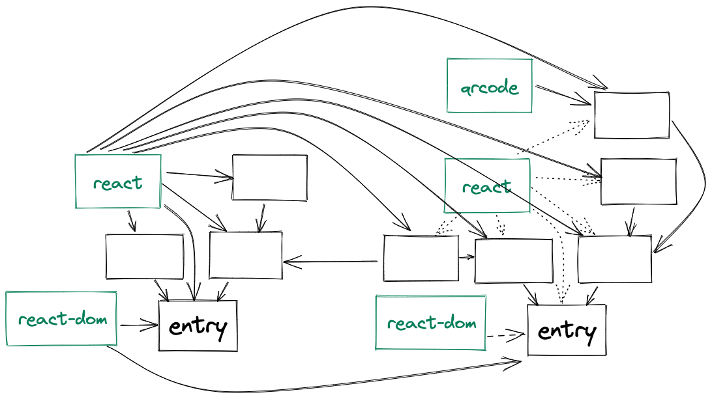
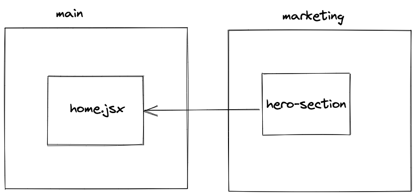
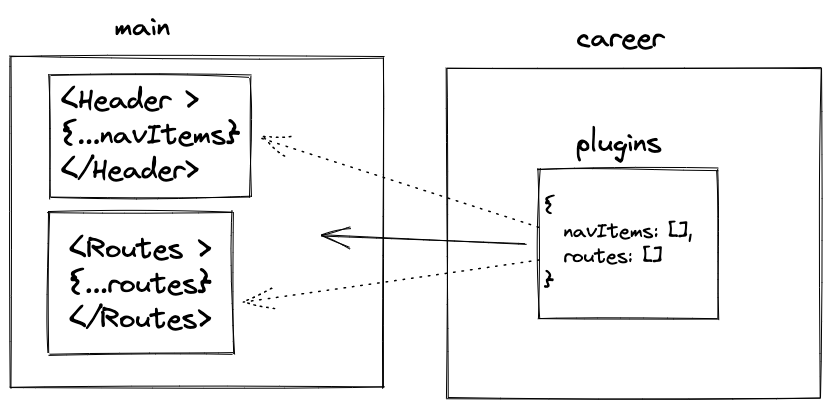
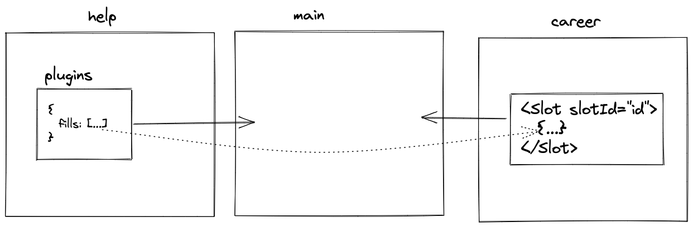

# Microfrontend using webpack module federation

## Agenda

1. [What is Microfrontend](#what-is-microfrontend)
1. [What is webpack module federation](#what-is-webpack-module-federation)
1. [What module federation enables](#what-module-federation-enables)
1. [Limitations of module federation](#limitations-of-module-federation)

## What is Microfrontend

[Microfrontend](https://martinfowler.com/articles/micro-frontends.html) is an architectural style where **independently deliverable** frontend applications are composed into a greater whole.

## What is webpack module federation

[Webpack module federation](https://webpack.js.org/concepts/module-federation/) is a webpack feature that allows sharing of modules across builds/applications.

Typical webpack builds looks like below:

With module federation, we can share the module from one webpack build **at runtime** with another webpack build, including dependencies:

### How it looks like in code

1. In the build that intends to share a module, configure webpack [like this](https://github.com/malcolm-kee/federation-marketing-app/blob/main/webpack.config.js#L108).
2. In the build that intends to consume a module, configure webpack [like this](../webpack.config.js#L107)
3. Then you can import the shared module using conventional ES Module syntax [like this](../src/pages/home.jsx#L2).

Step 2 and 3 can be skipped as loading remote module can be done dynamically [like this](../src/index.js#L8).

## What module federation enables

1. Granular build, deploy & rollback.

   

   - [Host](https://federation-host.fly.dev/)
   - [Remote](https://federation-marketing-nfkcgpvm8-malcolm-kee.vercel.app)
   - [Updated Remote](https://federation-marketing-app-git-fix-change-hero-malcolm-kee.vercel.app)

1. Plugin architecture, where new page and feature can be added dynamically.

   

   - [Nav item and path plugin](https://github.com/malcolm-kee/federation-career-app/blob/main/src/plugin.jsx#L4)
   - Slot/fill plugin: [Slot](https://github.com/malcolm-kee/federation-career-app/pull/4/files), [Fill](https://github.com/malcolm-kee/federation-help-app/blob/main/src/plugin.jsx#L4)

   

   - [Demo](https://federation-host.fly.dev/)

## Limitations of module federation

1. Tree-shaking for shared packages is not possible, because code that is not used by current build may be used by another build.
1. TypeScript: The dynamic nature of module federation does not work well with build time typechecking. Possible workaround is minimizing the cross-build integration points, e.g. using the plugin architecture.
1. Unit testing: Manual mocking is required for remote modules
1. E2E testing: module federation could not eliminate with E2E testing, in fact it increases its importance.

## Where to learn more

[`module-federation-examples` repo](https://github.com/module-federation/module-federation-examples), which showcases many examples and include more resources.
